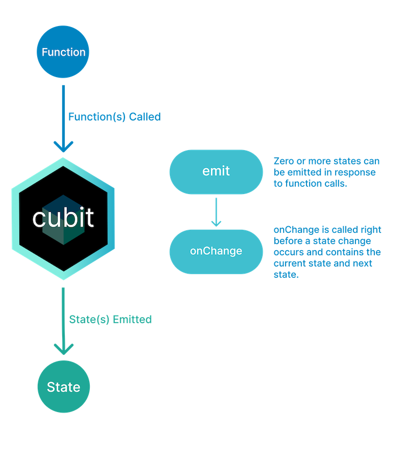

# Electus App
Artificial Intelligence based Applicant Tracking System, this is the mobile application version of the platform.

# State management
untuk state management di aplikasi ini kita menggunakan bloc, bloc ini menggunakan design pattern state, kalian bisa pelajari giman cara pakai bloc di sini https://pub.dev/packages/bloc


# Routing
GoRouter sebagai router aplikasi ini, kalian bisa pelajari gimana cara pakai GoRouter di sini https://pub.dev/packages/go_router, semua route yang essential akan di simpan di dalam app_router.dart.
# Development Stage
Jadi ada 3 tipe production stage, ubah sesuai kebutuhan kalian, dalam ini
**developmentUI, production, developmentRegular**
kalian ubah variabel appStage di ```lib/main.dart```, misalnya kalau kalian lagi
develop UI nya dan kalian lagi testing, kalian ubah appStage ini menjadi
'AppStage.developmentUI'
- Development UI: Kalo kalian lagi develop dan testing UI, dalam konteks ini middleware redirect tidak akan terlibat
- Development Regular: Jika kalian lagi develop aplikasi biasa dengan intervensi middleware

